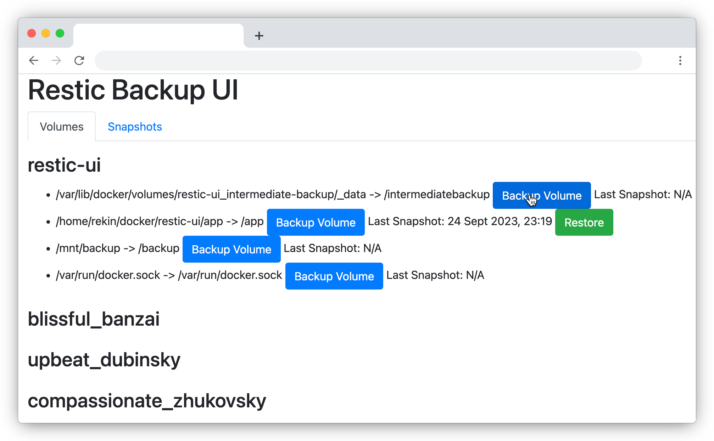

# Restic UI

A user-friendly web interface for [Restic](https://restic.net/), a fast, secure, multi-platform backup program. It provides easy management of Restic repositories, allowing users to create, backup, and restore snapshots of Docker volumes.

Restic-UI was developed to address a seemingly straightforward problem: the efficient backup and restoration of Docker volumes. Most of the prevalent recommendations appeared to be surprisingly constraining! For instance, some suggestions included using host-mounted volumes in lieu of named volumes and then configuring backups on the server side. However, named volumes are generally better managed by Docker (avoiding user ID issues and offering faster performance); compromising on this seemed unnecessary. The official Docker documentation proposes the use of a temporary Ubuntu Docker container. It suggests leveraging the `--volumes-from` option to mount volumes and running `tar` on them. However, this approach lacked robustness; it didn't offer scheduling, pruning, deduplication, or automation.

Another method, highlighted by Docker documents, is to export the entire container as a `.tar` file. However, I was reluctant to adopt this approach as most container data can be readily recreated during Docker image builds or by simply pulling from the Docker repository. I aimed to backup only the indispensable data and avoid unnecessary redundancies. The Docker Desktop plugin offers a solution for backing up volumes, but it is not available on servers without Docker Desktop. 

Even comprehensive Docker management tools like Portainer lack backup/restore functionality, despite ongoing requests from users for several years. Restic emerged as a robust and thoroughly tested solution for backups but inherently has no knowledge of Docker volumes. This project, Restic-UI, was initiated to bridge this gap. It interprets a list of containers and their volumes and conveys the data to Restic in a manner that leverages Restic's optimal features. Essentially, it generates temporary containers with volumes "borrowed" from your existing containers and executes Restic on them. Special metadata (tags) are incorporated to facilitate the future matching of containers to backups.

Currently, Restic-UI is in its nascent stages of development, and its capabilities are primarily limited to backing up data.



## Features

- Initialize Restic repositories.
- List Restic snapshots.
- Restore Restic snapshots.
- Backup Docker volumes.
- Intuitive UI to manage Restic operations.

## Prerequisites

- Docker
- Docker Compose 

## Setup & Installation

1. Clone this repository:

    ```sh
    git clone https://github.com/eurekin/restic-ui.git
    cd restic-ui
    ```

2. Create a restic.env file in the project root directory and add the necessary secret:

    ```env
    RESTIC_PASSWORD=yourresticpassword
    ```

3. Build and run the Docker containers using Docker Compose:

    ```sh
    docker-compose up -d --build
    ```

4. Open a web browser and navigate to http://localhost:5000 to access the Restic UI.


# Usage

## Initialize Repository

If the Restic repository is not initialized, click the Initialize Repository button on the web interface.

## Backup Docker Volumes
Go to the Volumes tab.
Identify the Docker container and the corresponding volume you want to backup.
Click the Backup Volume button next to the desired volume.

## Restore Snapshots

Go to the Snapshots tab.
Identify the snapshot you want to restore.
Click the Restore button next to the desired snapshot.

# Customization

To customize the appearance and functionality of the Restic UI, modify the app.py and the templates in the templates directory. Refer to the Flask and Jinja2 documentation for more information on customization.

# Development

## Debugging & Logging

Logging is configured to output to app.log in the project directory. For debugging purposes, you can view real-time logs using:

```sh
tail -f app.log
```

## Development Environment

To facilitate development, a docker-compose.override.yml file can be used to override settings in the main docker-compose.yml file, enabling features like live-reloading and mounting local code into the container.

## Reloading

Flask can be configured to automatically reload when changes are made to the source files. This can be enabled by setting the FLASK_ENV environment variable to development in the docker-compose.dev.yml file.

# License

This project is open source and available under the MIT License.

# Contribution

Contributions are welcome! Please feel free to submit a Pull Request.